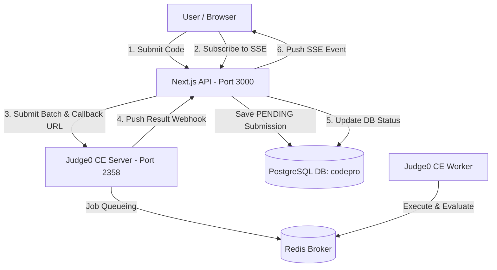

# Code Pro Deployment Guide

Welcome to the **Code Pro** deployment guide. This document describes the platform's multi-tier architecture, production containerization via Docker Compose, cloud deployment, and the automated CI/CD pipeline.

---

## 🏗️ System Architecture

Code Pro is built as a microservices-based monorepo consisting of:
1. **Next.js Web Frontend**: Server-side rendered UI and API Routes for Server-Sent Events (SSE) and Webhooks.
2. **Express API Server**: Handles core platform logic and authentication.
3. **Judge0 CE**: An open-source, sandbox-secured code execution engine.
4. **PostgreSQL**: Stores persistent relational data (users, problems, submissions, and contest rankings).
5. **Redis**: In-memory message broker used by Judge0 for job queueing.

### Traffic & Data Flow Diagram (Webhook + SSE Architecture)



---

## 🐳 Option 1: Containerized Deployment via Docker Compose

We provide two different Docker Compose configurations depending on your requirements:

### A. Development Mode (Infrastructure-Only)
In development, the databases and Judge0 run in containers while you run the application code locally for rapid hot-reloading.

1. **Start infrastructure services**:
   ```bash
   docker compose up -d
   ```
   *This starts PostgreSQL, Redis, and Judge0.*
2. **Install node dependencies and push schema**:
   ```bash
   npm install
   npm run db:push
   npm run db:seed
   ```
3. **Start the local development server**:
   ```bash
   npm run dev
   ```

### B. Production Mode (Azure VM + PM2 + Neon DB)
Our actual live production environment uses a hybrid approach to maximize performance while minimizing costs:

1. **Frontend (`apps/web`) & Backend API (`apps/api`)**: 
   - Deployed natively on an **Azure Ubuntu VM**.
   - Managed by **PM2** for process monitoring and zero-downtime restarts.
2. **Database**: 
   - Primary database is hosted on **Neon.tech** (Serverless Managed PostgreSQL).
3. **Code Execution Engine (Judge0)**: 
   - Runs securely inside **Docker containers** directly on the Azure VM. It utilizes an isolated local PostgreSQL and Redis instance for internal job queueing to prevent bloating the cloud database.

---

## 🔄 CI/CD Pipeline (GitHub Actions)

The repository features an automated workflow configured in [ci-cd.yml](file:///.github/workflows/ci-cd.yml) that triggers on pushes or pull requests to the `main` branch.

### 1. Integration & Build Phase (CI)
* Clones the repository.
* Installs dependencies via `npm ci`.
* Generates the Prisma client types.
* Lints the codebase (`npm run lint`).
* Compiles the Next.js and Express source code to check for compilation/type errors.
* Builds Docker images as artifacts (available in GHCR).

### 2. Delivery Phase (CD)
* Automatically runs after the Integration Phase passes.
* Connects to the **Azure VM** securely via SSH.
* Pulls the latest code from the `main` branch.
* Installs dependencies, regenerates the Prisma client, and builds the production Next.js/Express bundles locally on the VM.
* Executes `pm2 restart all` to seamlessly restart the live services with the new code.
