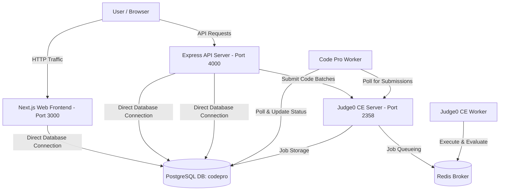

# Code Pro Deployment Guide

Welcome to the **Code Pro** deployment guide. This document describes the platform's multi-tier architecture, production containerization via Docker Compose, cloud deployment, and the automated CI/CD pipeline.

---

## 🏗️ System Architecture

Code Pro is built as a microservices-based monorepo consisting of:
1. **Next.js Web Frontend**: Server-side rendered UI.
2. **Express API Server**: Handles core platform logic, authentication, and submits jobs to Judge0.
3. **Background Worker**: A lightweight Node.js/TypeScript daemon that polls Judge0 and updates submission statuses.
4. **Judge0 CE**: An open-source, sandbox-secured code execution engine.
5. **PostgreSQL**: Stores persistent relational data (users, problems, submissions, and contest rankings).
6. **Redis**: In-memory message broker used by Judge0 for job queueing.

### Traffic & Data Flow Diagram



---

## 🐳 Option 1: Containerized Deployment via Docker Compose

We provide two different Docker Compose configurations depending on your requirements:

### A. Development Mode (Infrastructure-Only)
In development, the databases and Judge0 run in containers while you run the application code locally for rapid hot-reloading.

1. **Start infrastructure services**:
   ```bash
   docker compose up -d
   ```
   *This starts PostgreSQL, Redis, and Judge0.*
2. **Install node dependencies and push schema**:
   ```bash
   npm install
   npm run db:push
   npm run db:seed
   ```
3. **Start the local development server**:
   ```bash
   npm run dev
   ```

### B. Production Mode (Full Stack in Containers)
In production, all services—including the Web, API, and Worker applications—are built as optimized production containers.

1. **Verify your environment variables**:
   Create a root `.env` or verify that your services are pointing to `db` instead of `localhost` in production.
2. **Build and start the complete stack**:
   ```bash
   docker compose -f docker-compose.prod.yml up --build -d
   ```
3. **How it works behind the scenes**:
   * **`db-migrate`**: Spins up temporarily to run `npx prisma db push` and `npx tsx seed` to prepare the database.
   * **Health checks**: Services like `api` and `web` wait to launch until `db-migrate` has successfully exited.
4. **Access the application**:
   * Web App: [http://localhost:3000](http://localhost:3000)
   * API Server: [http://localhost:4000](http://localhost:4000)
   * Judge0 API: [http://localhost:2358](http://localhost:2358)

---

## 🚀 Option 2: Cloud Deployment (Vercel + Render + Neon)

For production deployment without managing virtual machines:
1. **Frontend (`apps/web`)**: Deployed on **Vercel**.
2. **Backend API (`apps/api`) & Worker (`apps/worker`)**: Deployed on **Render**.
3. **Database**: Managed PostgreSQL on **Neon.tech**.
4. **Code Execution**: Configured via cloud-hosted **Judge0 API**.

---

## 🔄 CI/CD Pipeline (GitHub Actions)

The repository features an automated workflow configured in [ci-cd.yml](file:///.github/workflows/ci-cd.yml) that triggers on pushes or pull requests to the `main` branch.

### 1. Integration Phase (CI)
* Clones the repository.
* Installs dependencies via `npm ci`.
* Generates the Prisma client types.
* Lints the codebase (`npm run lint`).
* Compiles the Next.js, Express, and Worker source code to check for compilation/type errors (`npm run build`).

### 2. Delivery Phase (CD)
* Automatically runs after the Integration Phase passes.
* Logs into the **GitHub Container Registry (GHCR)**.
* Dynamically builds Docker images for `api`, `web`, and `worker` using Docker Buildx and caches.
* Tags and pushes the resulting images to `ghcr.io/akshatg-coder/codepro-<service>:latest`.
